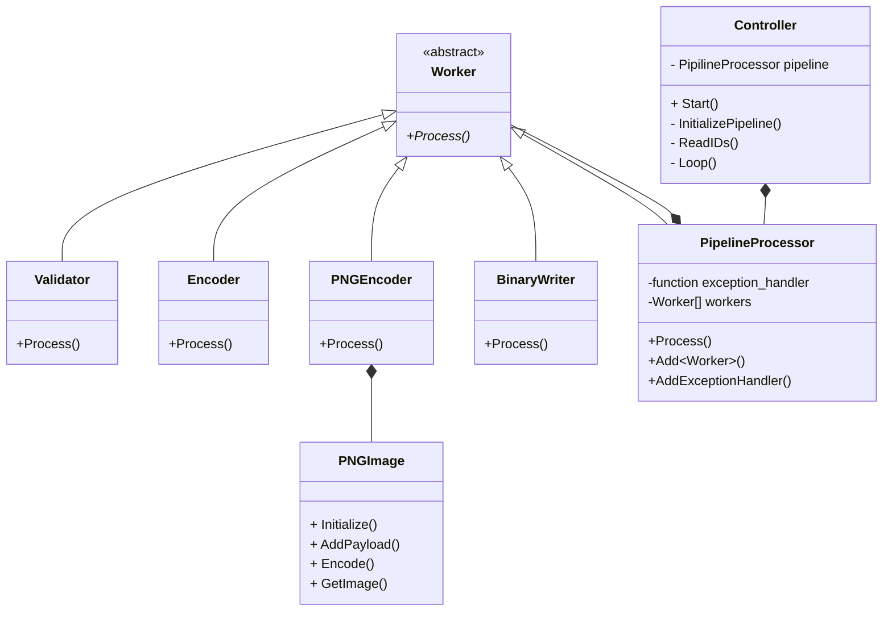

# Task Description

## Version
**Platform Toolset - Visual Studio (v142)**

## Clone Home Task
```
git clone https://github.com/dliutyi/DHT.git
cd .\DHT
```

### Clone dependencies
``` 
git clone https://github.com/glennrp/libpng.git
git clone https://github.com/madler/zlib.git
```

### Folder structure

- `.git`
- `DHT`
- `libpng`
- `UnitTests`
- `zlib`
- `.gitignore`
- `DHT.sln`
- `README.md`

## Setup libpng
Open `.\libpng\projects\vstudio`

### Create x64
- Go to **Build -> Configuration Manager -> Active solution platform -> Add**
- Select **x64** in "Type or select the new platform"
- Select **Win32** in "Copy settings from"

### Build Win32|x64
- Select a configuration **Debug Library|Release Library** and **Win32|x64**
- Start **Build** the solution

## Run DHT
- Open `.\DHT.sln`
- Select a configuration **Debug|Release** and **x86|x64**
- Start **Build** the solution
- Run tests

> There is **Configuration.h** which contains output folder and file with IDs

## Class diagram



## Extend the number of IDs
16 bits are reserved for the checksum now, if the number of reserved checksum bits are shortened, the bigger number of IDs is available within 6 digits display.